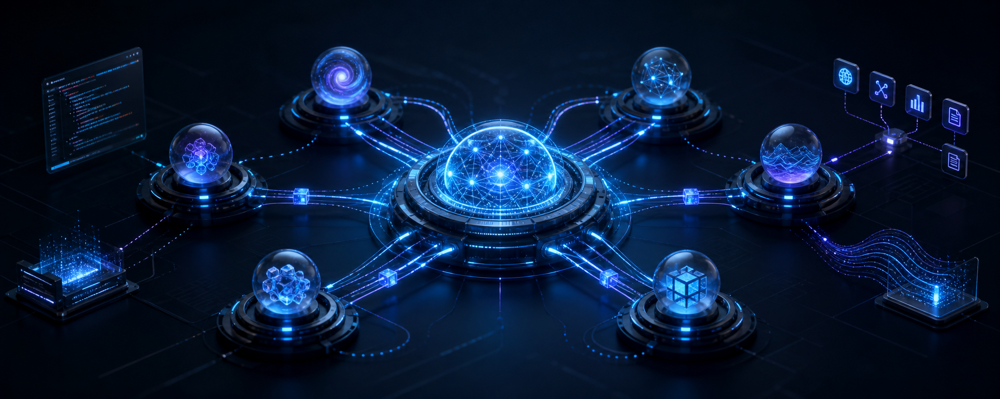

  

# Hi, I'm Ashkan 👋

I build AI-powered tools and agentic workflows that turn language models into useful, reliable systems.

## Main focus

- AI agents and multi-agent systems
- LLM applications, tool use, and workflow automation
- Model Context Protocol (MCP) and API integrations
- Retrieval, evaluation, and reliable agent behavior

## Technical background

- Embedded C/C++, STM32, and ARM Cortex-M
- Sensor integration, networking, and hardware–software debugging

## What you'll find here

Practical experiments and projects around agents, automation, and AI-assisted development—with clear documentation and reproducible setup steps.

> Building agents that can reason, use tools, and get real work done.
